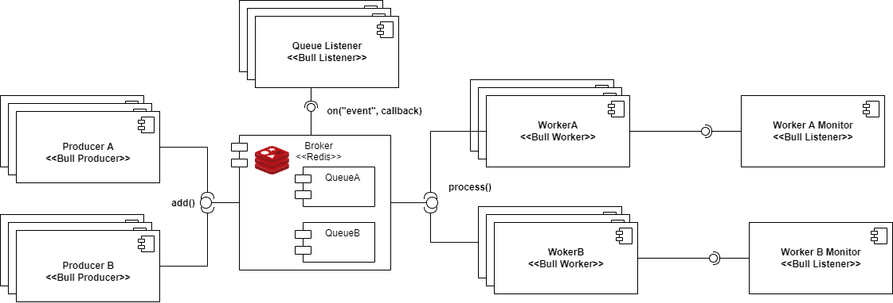

# Worker Architecture using Bull

This repository is a simple [worker architecture](https://www.enterpriseintegrationpatterns.com/patterns/messaging/CompetingConsumers.html) implementation in node using the [Bull](https://github.com/taskforcesh/bullmq) library, including:

- Producers
- Message Broker (Redis)
- Consumers
- Dashboard

All the components of the system are dockerized, so every component can be scaled to hold a higher throughput of work.

# How to run

## One container of each service

```
docker compose up -d
```

## Scaling the number of workers

```
docker compose up -d --scale worker={number_of_workers}
```

## Documentation:

- [Bull docs](https://docs.bullmq.io/)

The architecture of the project is the following



## Useful Concepts:

[Message Broker](https://www.enterpriseintegrationpatterns.com/patterns/messaging/MessageBroker.html)

For general integration patterns concepts go to: https://www.enterpriseintegrationpatterns.com/patterns/messaging/
